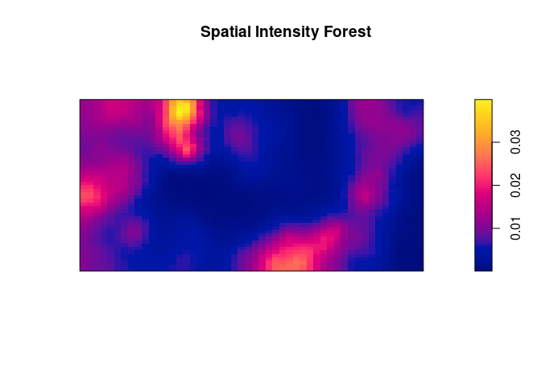
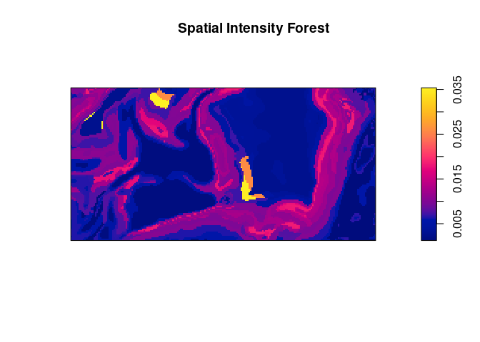

# spforest

<!-- badges: start -->
<!-- badges: end -->

The goal of is to estimate the intensity of a 2D point process with
spatial random intensity forest. The package but can be considered in
its pre-alpha version and is currently under heavy development. In
particular, its documentation can be considered in its infancy.

## Installation

The package depends on the package
[spatstat.](https://github.com/spatstat/spatstat) which you should
install first.

Then, you can install the development version of from
[GitHub](https://github.com/) with:

``` r
# install.packages("pak")
pak::pak("biscio/spforest")
```

## Basic example without covariate

By default, the function will work without any covariates.

``` r
library(spforest)
#> Loading required package: spatstat.model
#> Loading required package: spatstat.data
#> Loading required package: spatstat.univar
#> spatstat.univar 3.0-0
#> Loading required package: spatstat.geom
#> spatstat.geom 3.3-2
#> Loading required package: spatstat.random
#> spatstat.random 3.3-1
#> Loading required package: spatstat.explore
#> Loading required package: nlme
#> spatstat.explore 3.3-2
#> Loading required package: rpart
#> spatstat.model 3.3-1
forestnocov <- spforest(
  X = spatstat.data::bei,
  Ntree = 100,
  listcovariates = NULL,
  lambda = 100,
  dimyx = c(50, 50),
  test.connected = FALSE
)
```

``` r
plot(forestnocov)
```



## Basic example with covariates

``` r
library(spforest)
forest <- spforest(
  X = spatstat.data::bei,
  listcovariates = spatstat.data::bei.extra, ,
  Ntree = 50,
  mtry = 1,
  minpts = 200,
  cores = 1
)
```

``` r
plot(forest)
```


