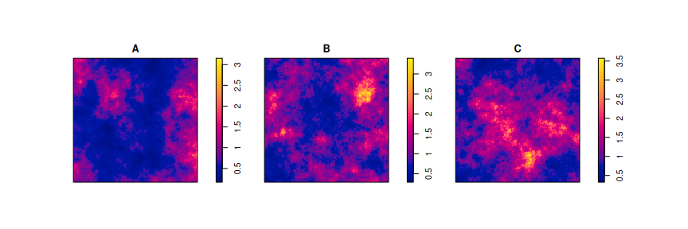
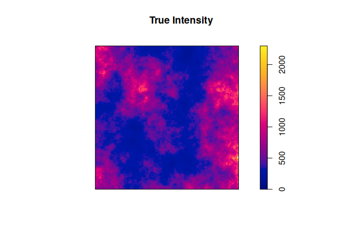
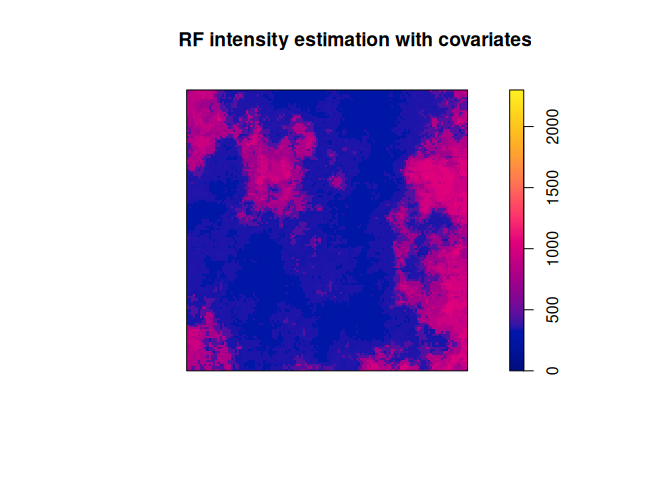
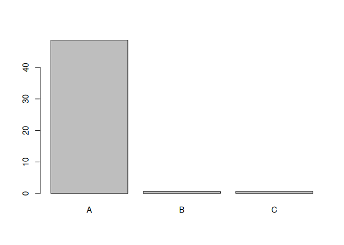
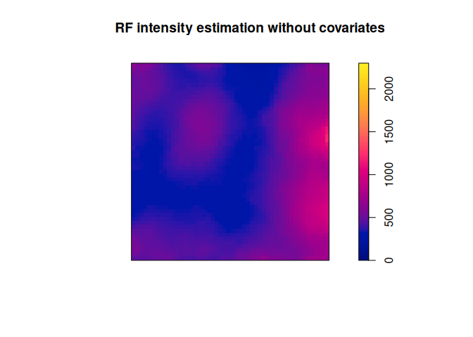
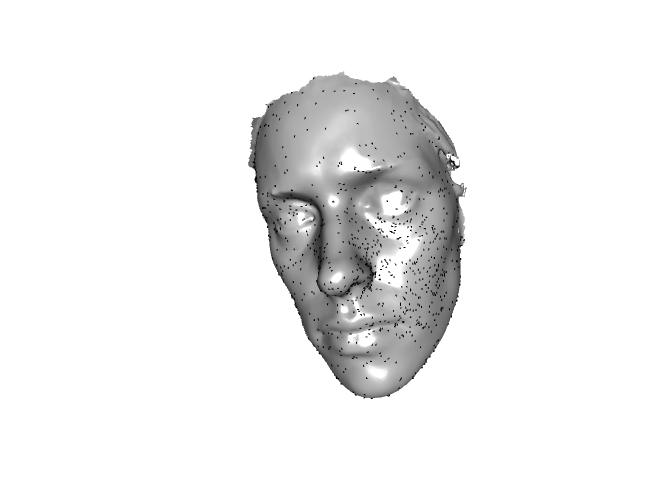
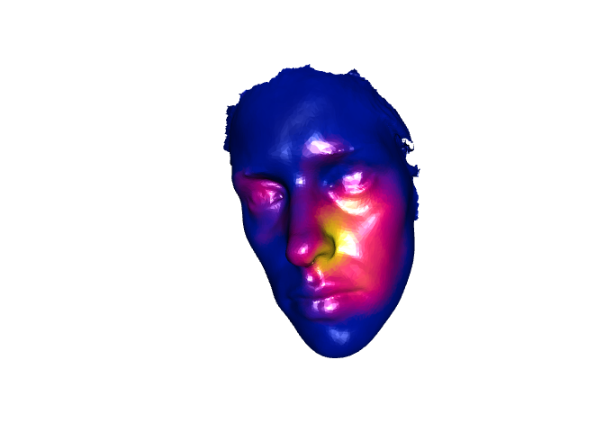

# Getting started with spforest


## Requirements

To install the package directly from Github, with the minimum version to
run this vignette, run the following command.

``` r
if (!requireNamespace("pak")) {install.packages("pak")}
if (!requireNamespace("spforest")) {pak::pkg_install("biscio/spforest")}
library(spforest)
```

## Generation of a synthetic dataset

We simulate three realisations of a Gaussian random field which we will
treat as covariates.

``` r
set.seed(10)
simcov <- solapply(
  spatstat.random:::rGRFexpo(
    W = square(1),
    mu = 0,
    var = 0.2,
    scale = 0.2,
    nsim = 3
  ),
  exp
)
names(simcov) <- c("A", "B", "C")
plot(simcov, main = "")
```



Now, let’s simulate an inhomogeneous Poisson point process `X` whose
intensity depends on the covariate `A`, that is the first random field.
The intensity is normalised to have, in average, 500 points.

``` r
lambda0 <- 500 * simcov[[1]] / integral(simcov[[1]])
X <- spatstat.random::rpoispp(lambda = lambda0)
```

Let’s fix the colour map for all plots.

``` r
cm <- colourmap(default.image.colours(), range = c(0, 2300))
```

The true intensity is shown below.

``` r
plot(lambda0, col = cm, main = "True Intensity")
```



The generated point pattern `X` is shown on the plot below.

``` r
plot(X, main = "", pch = 20, cex = 0.8)
```


## Random forest intensity estimation with covariates

We estimate in this section the intensity of `X` using the three
covariates `A`, `B` and `C` stored in the list `simcov`.

The computation of the random forest intensity estimator is handled by
the `spforest` function. It applies to a point pattern of class `ppp`
and the covariates are supplied as a list of images (of class `im`).

For this notebook, the hyperparameters are set arbitrarely to

- `Ntree = 100`: 100 tree intensity estimators are averaged;
- `mtry = 3`: at each split in a tree, the three covariates are used;
- `minpts = 100`: we do not try to split a cell if there is less that
  100 points in the cell.

(Note that these hyperparameters can be optimised by OOB
cross-validation with the function `OOBoptim`.)

``` r
RF <- spforest(
  X = X,
  listcovariates = simcov,
  Ntree = 100,
  mtry = 3,
  minpts = 100
)
```

``` r
plot(RF, main = "RF intensity estimation with covariates", col = cm)
```



Finally, we can compute and plot the variable importance of each
covariate. As expected, the most important one is `A`.

``` r
vipplot(RF)
```



## Random forest intensity estimation on the plane without covariates

We estimate in this section the intensity of `X` without using any
covariate, but only the spatial coordinates of the points. This is the
default behavior of the `spforest` function when no covariates are
specified.

The intensity estimator is then computed with `Ntree` independent and
identically distributed Poisson Voronoï tessellations, each with
intensity `gamma`. A sensible default value for `gamma` is computed
automatically, based on the Freedman-Diaconis rule for selecting
histogram bin widths.

``` r
RFnocov <- spforest(X, Ntree = 100)
plot(RFnocov, col = cm, main="RF intensity estimation without covariates")
```



## Random forest intensity estimation on a manifold

To work with 3D-meshes of manifolds, we rely on the `rgl` package. In
this case, the main argument of the `spforest` function should be a list
containing the mesh (of class `mesh3d`) and the point pattern
(represented as a three-column matrix).

As an example, we use a simulated point pattern that we generated on the
manifold `humface` from the R package `Rvcg`. The list object
`simppface` contains the 3D-mesh and the generated points. They are
represented below.

``` r
library(rgl)
library(Rvcg)
XX <- spforest::simppface
shade3d(XX$mesh, col = "gray")
points3d(XX$pp, col = "black", size = 2, add = T)
view3d(theta = 20, phi = 0)
```



We now estimate the intensity of points, using `Ntree=100` independent
Poisson Voronoï tessellations generated on the manifold.

``` r
forestmesh <- spforest(X = XX, Ntree = 100)
plot(forestmesh)
view3d(theta = 20, phi = 0)
```


