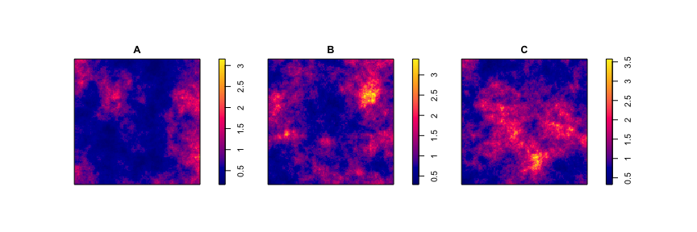
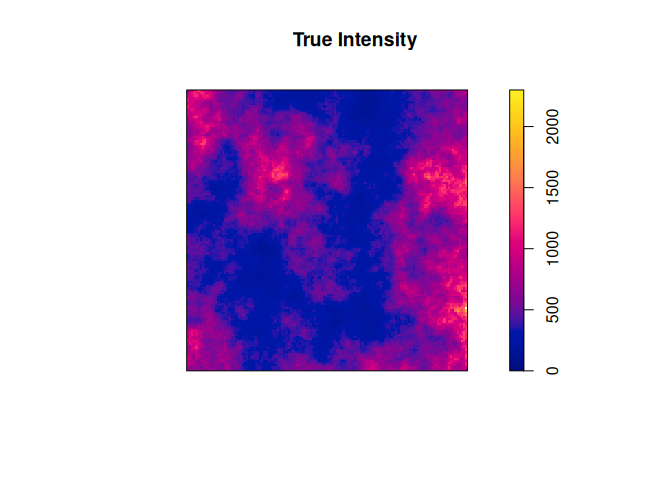
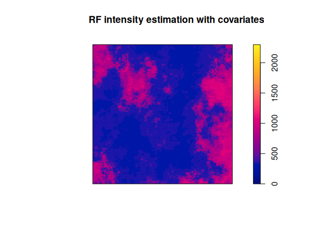
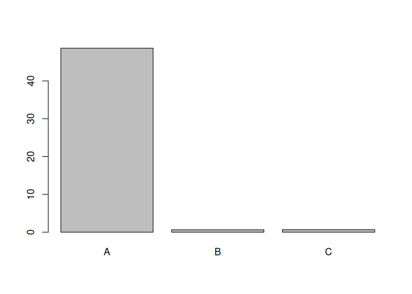
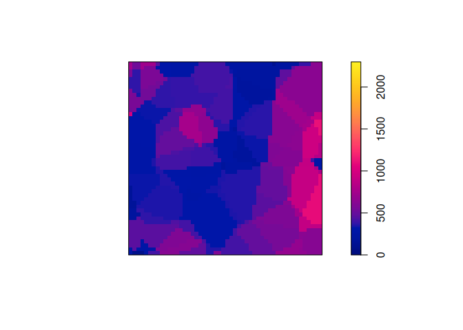
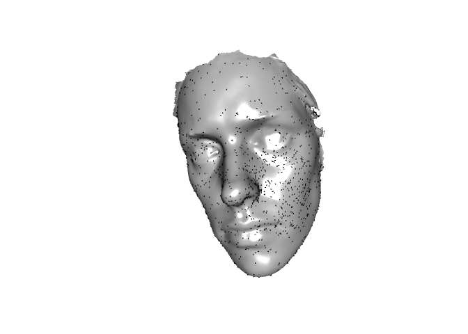
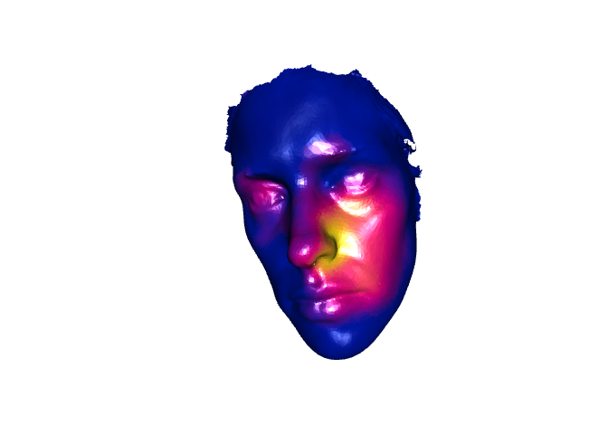
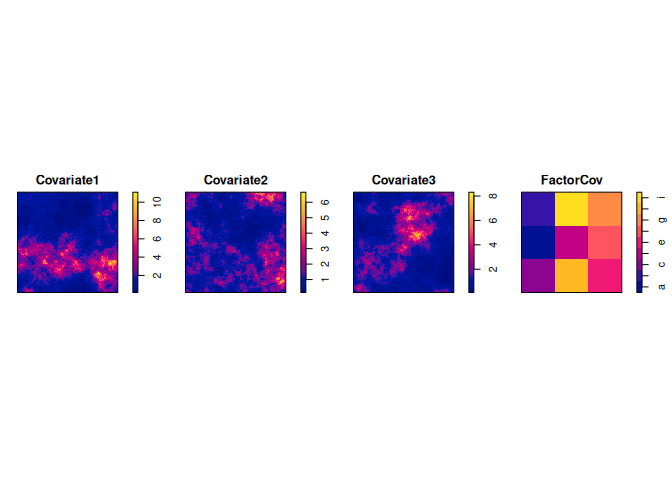
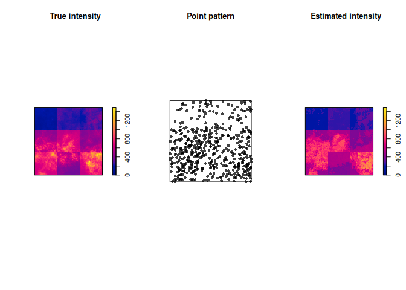
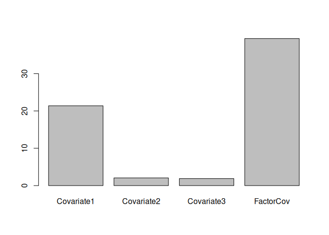

# Getting started with spforest


## Requirements

To install the package directly from Github, with the minimum version to
run this vignette, run the following command.

``` r
if (!requireNamespace("pak")) {
  install.packages("pak")
}
if (!requireNamespace("spforest")) {
  pak::pkg_install("biscio/spforest")
}
library(spforest)
```

## Generation of a synthetic dataset

We simulate three realisations of a Gaussian random field which we will
treat as covariates.

``` r
set.seed(10)
simcov <- solapply(
  spatstat.random:::rGRFexpo(
    W = square(1),
    mu = 0,
    var = 0.2,
    scale = 0.2,
    nsim = 3
  ),
  exp
)
names(simcov) <- c("A", "B", "C")
plot(simcov, main = "")
```



Now, let’s simulate an inhomogeneous Poisson point process `X` whose
intensity depends on the covariate `A`, that is the first random field.
The intensity is normalised to have, in average, 500 points.

``` r
lambda0 <- 500 * simcov[[1]] / integral(simcov[[1]])
X <- spatstat.random::rpoispp(lambda = lambda0)
```

Let’s fix the colour map for all plots.

``` r
cm <- colourmap(default.image.colours(), range = c(0, 2300))
```

The true intensity is shown below.

``` r
plot(lambda0, col = cm, main = "True Intensity")
```



The generated point pattern `X` is shown on the plot below.

``` r
plot(X, main = "", pch = 20, cex = 0.8)
```


## Random forest intensity estimation with covariates

We estimate in this section the intensity of `X` using the three
covariates `A`, `B` and `C` stored in the list `simcov`.

The computation of the random forest intensity estimator is handled by
the `spforest` function. It applies to a point pattern of class `ppp`
and the covariates are supplied as a list of images (of class `im`).

For this notebook, the hyperparameters are set arbitrarely to

- `Ntree = 100`: 100 tree intensity estimators are averaged;
- `mtry = 3`: at each split in a tree, the three covariates are used;
- `minpts = 100`: we do not try to split a cell if there is less that
  100 points in the cell.

(Note that these hyperparameters can be optimised by OOB
cross-validation with the function `OOBoptim`.)

``` r
RF <- spforest(
  X = X,
  listcovariates = simcov,
  Ntree = 100,
  mtry = 3,
  minpts = 100,
  parallel = FALSE
)
```

``` r
plot(RF, main = "RF intensity estimation with covariates", col = cm)
```



Finally, we can compute and plot the variable importance of each
covariate. As expected, the most important one is `A`.

``` r
vipplot(RF)
```



## Random forest intensity estimation on the plane without covariates

We estimate in this section the intensity of `X` without using any
covariate, but only the spatial coordinates of the points. This is the
default behavior of the `spforest` function when no covariates are
specified.

The intensity estimator is then computed with `Ntree` independent and
identically distributed Poisson Voronoï tessellations, each with
intensity `gamma`. A sensible default value for `gamma` is computed
automatically, based on the Freedman-Diaconis rule for selecting
histogram bin widths.

``` r
RFnocov <- spforest(X, Ntree = 100, parallel = FALSE)
plot(RFnocov, col = cm, main = "RF intensity estimation without covariates")
```



## Random forest intensity estimation on a manifold

To work with 3D-meshes of manifolds, we rely on the `rgl` package. In
this case, the main argument of the `spforest` function should be a list
containing the mesh (of class `mesh3d`) and the point pattern
(represented as a three-column matrix).

As an example, we use a simulated point pattern that we generated on the
manifold `humface` from the R package `Rvcg`. The list object
`simppface` contains the 3D-mesh and the generated points. They are
represented below.

``` r
library(rgl)
library(Rvcg)
XX <- spforest::simppface
shade3d(XX$mesh, col = "gray")
points3d(XX$pp, col = "black", size = 2, add = TRUE)
view3d(theta = 20, phi = 0)
```



We now estimate the intensity of points, using `Ntree=100` independent
Poisson Voronoï tessellations generated on the manifold.

``` r
forestmesh <- spforest(X = XX, Ntree = 100, parallel = FALSE)
plot(forestmesh)
view3d(theta = 20, phi = 0)
```



## Random forest intensity estimation with factor valued covariable.

The `spforest` function can also handle factor valued covariates. To
that end, we assign to each region with a given factor value, the number
of points in that region divided by the area of the region. Then we use
this “new” continuous valued covariate in the `spforest` function in
place of the original factor valued covariate.

Let first simulate several covariates, including one factor valued
covariate, on the unit square. We set the factor to be the letters:
$\{a, b, c, d, e, f, g, h, i\}$ and we assign randomly one of these
letters to each sub-square of the unit square. We also put all the
covariate at the same resolution.

``` r
set.seed(909)
contcovar <- spatstat.random::rGRFexpo(
  W = square(1),
  mu = 0,
  var = 0.5,
  scale = 0.2,
  nsim = 3
) |> solapply(exp)
names(contcovar) <- paste0("Covariates", 1:3)
Z <- matrix(factor(letters[sample(9)]), nrow = 3)

allcov <- append(contcovar, list(Z))
names(allcov) <- c(paste0("Covariate", 1:3), "FactorCov")
allcov[[4]] <- as.im(allcov[[4]], W = commonGrid(contcovar[[1]], Z))
```

Here is a plot of all the covariates, including the factor valued
covariate.

``` r
plot(as.anylist(allcov), main = "", ncols = 4)
```



We simulate a Poisson point process with intensity depending on the
factor value covariate and the first covariate. We normalise the
intensity to get on average 500 points.

``` r
Znum <- as.im(
  matrix(sample(1:20, size = 9), nrow = 3),
  W = square(1)
)
Znum <- as.im(Znum, W = commonGrid(contcovar[[1]], Z))
trend <- Znum + 3 * allcov[[1]]
trueint <- 500 * trend / mean(trend)
X <- spatstat.random::rpoispp(lambda = trueint)
```

We can now use `spforest` as before.

``` r
Example1_RF <- spforest(
  X = X,
  listcovariates = allcov,
  Ntree = 200,
  minpts = 50,
  mtry = 3,
  parallel = F
)
```

    Warning in tesscovforest(X, listcovariates = newlistcov, Ntree = Ntree, : The im objects in listcovariates have been
        harmonised with the function harmonise.im.

Here is a plot of the true intensity, the point pattern and the
estimated intensity.

``` r
par(mfrow = c(1, 3))
cm_ex1 <- colourmap(
  col = default.image.colours(),
  range = c(0, max(range(as.im(Example1_RF))[2], range(trueint)[2]))
)
plot(trueint, col = cm_ex1, main = "True intensity")
plot(X, pch = 16, cex = 1, main = "Point pattern")
plot(Example1_RF, col = cm_ex1, main = "Estimated intensity")
```



Finally, we can still compute the variable importance.

``` r
vipplot(Example1_RF)
```


